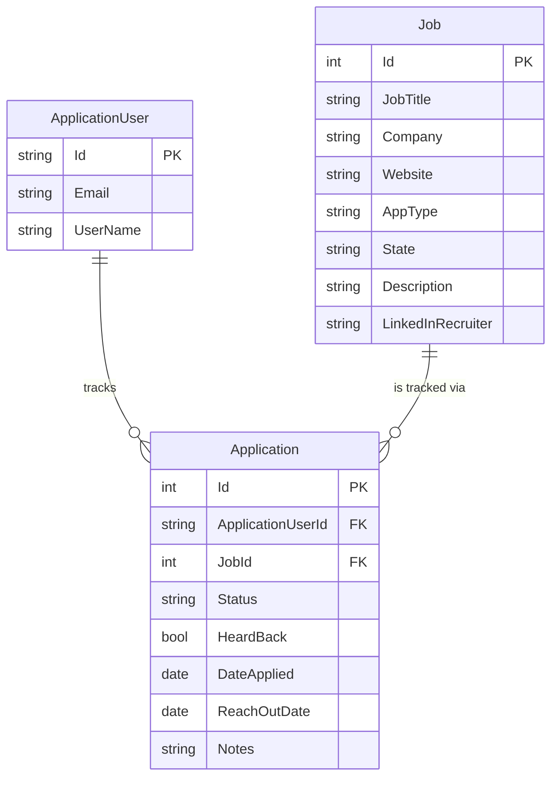

## JobApplicationTracker
A Job Application Tracker built in C# to practice authentication authorization and full stack development with ASP.net.

Stack: Frontend + Backend → Blazor Web App (Interactive Server) | Auth → ASP.NET Identity | Database → EF Core

## Description: 

I'm building this project to develop proficiency in building full stack web applications. Currently, I keep track of the jobs I've applied to through an Excel spreadsheet, however, this makes it hard to visualize them individually and making any changes to how the data is formatted kept track means I have to extend or change the whole sheet. Additionally, any kind of job specific notes just ends up as a comment which makes it extremely clustered. this projects goal is to simplify the entire process so I can focus on applying more efficiently. 

## Setup

*(Coming soon — setup instructions will be added once the initial project structure is in place.)*

## Implementation Plan

1. Data model design
- Define core entities (Application, Company, Contact, Reminder, etc.)
- Plan out the Blazor pages/components needed for CRUD operations on applications
  
**2. Database architecture**
- Design schema in EF Core (relationships between applications, companies, and users
- Set up migrations

**3. User accounts and authentication/authorization**
- Implement user model and registration/login 
- Wire up ASP.NET Identity
- Handle Roles and Permissions
  
**4. Seed test data**
- Seed demo users and sample applications for testing/demoing

**5. Excel wrapper - design**
- Map out how existing spreadsheet columns translate into the app's data format
- Handle edge cases (missing dates, inconsistent status labels, etc.)

**6. Excel wrapper - implementation**
- Build import tool to pull data from the existing spreadsheet into the database
- Add export option to go back to Excel if needed

# Architecture:

# Future Ideas for project
- AI assisted recruiter lookup
- view other users(friends) profiles and allow to view them
- send recommendations to other users(friends)
