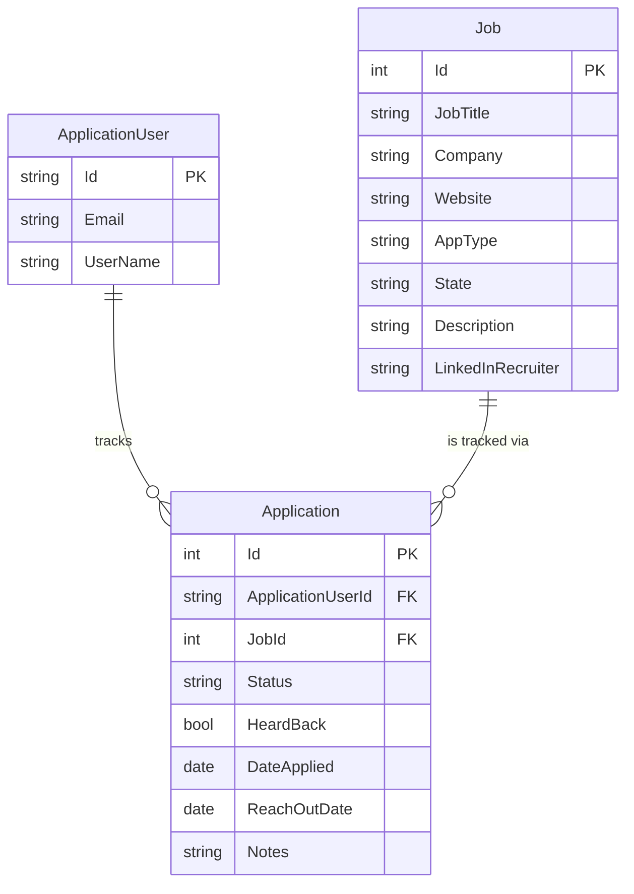

## JobApplicationTracker
A Job Application Tracker built in C# to practice authentication, authorization, and full stack development with ASP.NET.

Live demo: https://jobapplicationtracker-qgyq.onrender.com

Stack: Frontend + Backend → Blazor Web App (Interactive Server) | Auth → ASP.NET Identity | Database → EF Core + Azure SQL | Testing → xUnit + bUnit | Hosting → Docker on Render | CI/CD → GitHub Actions

## Description

I'm building this project to develop proficiency in building full stack web applications. Currently, I keep track of the jobs I've applied to through an Excel spreadsheet, however, this makes it hard to visualize them individually, and any change to how the data is formatted or tracked means I have to extend or change the whole sheet. Additionally, any kind of job specific notes just ends up as a comment, which makes it extremely cluttered. This project's goal is to simplify the entire process so I can focus on applying more efficiently.

## Setup

1. Clone repository
2. Set the database connection string: `dotnet user-secrets set "ConnectionStrings:DefaultConnection" "<your SQL Server connection string>"`
3. Run project (dotnet build -> dotnet run, or dotnet watch)
4. Login is auto seeded
5. Run tests: `dotnet test JobApplicationTracker.Tests`

## Implementation Plan

**1. Data model design** - Done
- Define core entities (Application, Company, Contact, Reminder, etc.)
- Plan out the Blazor pages/components needed for CRUD operations on applications

**2. Database architecture** - Done
- Design schema in EF Core (relationships between applications, companies, and users)
- Set up migrations

**3. User accounts and authentication/authorization** - Done
- Implement user model and registration/login
- Wire up ASP.NET Identity
- Handle Roles and Permissions

**4. Seed test data** - Done
- Seed demo users and sample applications for testing/demoing

**5. Excel wrapper - design** - Done
- Map out how existing spreadsheet columns translate into the app's data format
- Handle edge cases (missing dates, inconsistent status labels, etc.)

**6. Excel wrapper - implementation** - Done
- Build import tool to pull data from the existing spreadsheet into the database
- Add export option to go back to Excel if needed

**7. Automated testing** - Done
- Unit tests for pure parsing logic (xUnit)
- Integration tests for the service layer against a real SQL database (xUnit + SQLite)
- Component tests for Blazor components (bUnit)
- CI pipeline via GitHub Actions runs the suite on every pull request, required to pass before merging to main

**8. Production database migration** - Done
- Migrated from local SQLite to Azure SQL Database
- Refactored data access to use IDbContextFactory instead of a shared DbContext, fixing a concurrency crash that only showed up under real network latency
- Added retry-on-failure handling for the database's serverless auto-pause behavior

**9. Deployment** - Done
- Containerized the app with Docker
- Deployed to Render, connected to the Azure SQL database
- GitHub Actions builds and deploys automatically on every push to main

# Architecture:

```mermaid
erDiagram
  ApplicationUser ||--o{ Application : tracks
  Job ||--o{ Application : "is tracked via"

  ApplicationUser {
    string Id PK
    string Email
    string UserName
  }
  Job {
    int Id PK
    string JobTitle
    string Company
    string Website
    string AppType
    string State
    string Description
    string LinkedInRecruiter
  }
  Application {
    int Id PK
    string ApplicationUserId FK
    int JobId FK
    string Status
    bool HeardBack
    date DateApplied
    date ReachOutDate
    string Notes
  }
```

# TODO:
- [ ] Add show password icon and implementation for all password fields not just the login screen
- [X] Excel Import Implementation
- [X] Larger view mode other than just the original
- [X] Fix editor not working by clicking on row in small view mode
- [X] Set up the database as a server via Azure
- [ ] Fix error on edit row in modal for small view staying after exiting edit and adding new application or editing another
- [ ] Migrate to remove passkey-related database tables
- [ ] Automatic reach out date implementation
- [ ] Figure out how to handle notifications
- [ ] Send a notification when reach out date is hit
- [ ] Figure out where notifications should be (for reaching out and user recommendations)
- [ ] Fix bug where edit table shows up when clicking the delete icon
- [ ] Get rid of searching in small view (not working)
- [ ] Add Stats viewer
- [X] Fix DbContext concurrency crash on page load (fixed by switching to IDbContextFactory so services no longer share a single DbContext instance)
- [ ] Fix grid.RefreshDataAsync() being called unconditionally in HandleSubmit and RunImport even when in card view (grid ref is null/stale there)
- [ ] Fix overlapping GUI on list view when job list is empty
- [ ] Expand the sort test in ApplicationServiceTests to cover all sort fields, not just CompanyName
- [ ] Add third-party login (Google, GitHub, etc.)

# Future Ideas for project
- AI assisted recruiter lookup
- view other users (friends) profiles and allow to view them
- send recommendations to other users (friends)
